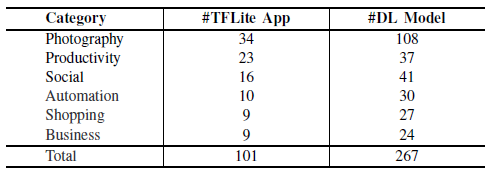
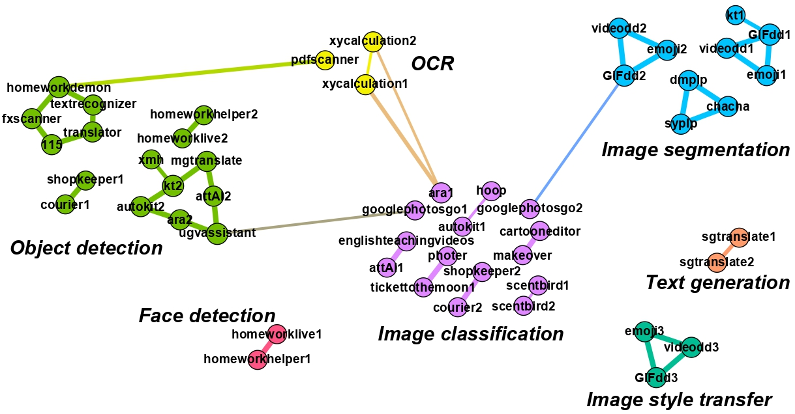
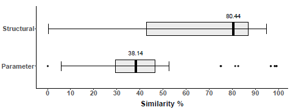
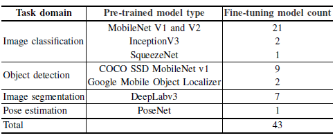
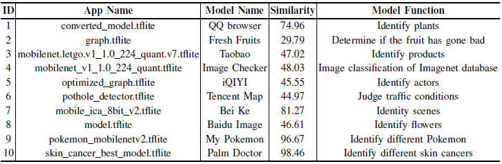
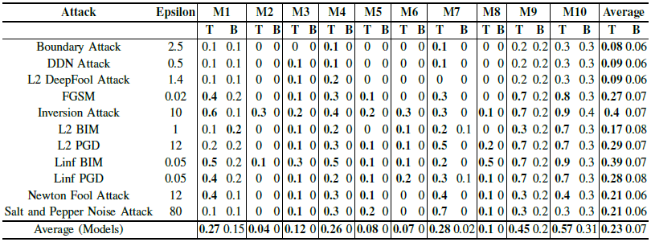
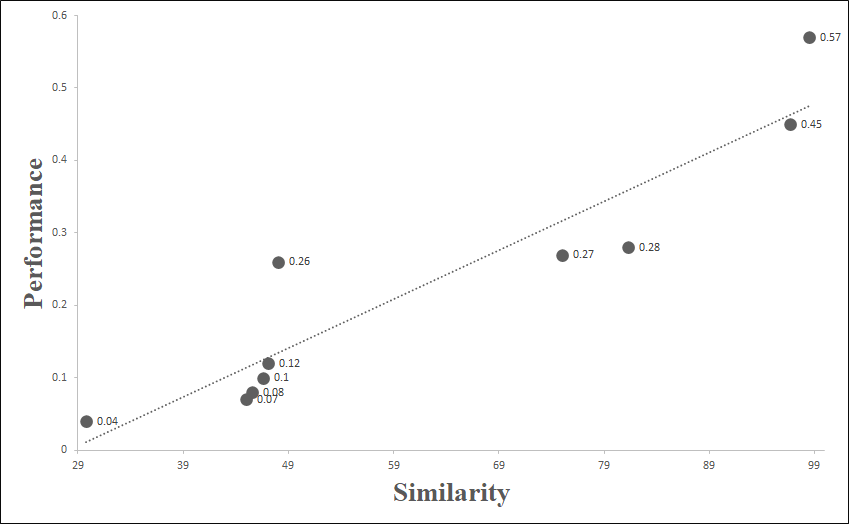

# Robustness of on-device Models: AdversarialAttack to Deep Learning Models on Android Apps
Deep learning has shown its power in many applications, including object detection in images, natural-language understanding, speech recognition. To make it more accessible to
end-users, __many deep learning models are embedded in mobile apps__. 

Compared to offloading deep learning from smartphones to the cloud, performing machine learning on-device can help improve latency, connectivity, and power consumption. However, most deep learning models within Android apps __can be easily obtained via mature reverse engineering__, and the model exposure may invite __adversarial attacks__. 

In this study, we propose __a simple but effective approach to hack deep learning models with adversarial attacks by identifying their highly similar pre-trained models from TensorFlow Hub__. All 10 real-world Android apps in the experiment are successfully attacked by our approach. Apart from the feasibility of the model attack, we also carry out an empirical study to investigate the characteristic of deep learning models of hundreds of Android apps from Google Play. The results show that many of them are similar to each other and widely use fine-tuning techniques to pre-trained models on the Internet.

## Details
To demonstrate our task, we first show some common mobile and edge use cases achieved via on-device model inference, as shown in Fig 1.

   
  <em>Fig. 1. Optimized on-device deep learning models for common mobile and edge use cases from https://www.tensorflow.org/lite/models.</em>

Unlike the central guardians of the cloud server, on-device models may be more vulnerable inside users’ phones. For instance, most model files can be obtained by decompiling Android apps without any obfuscation or encryption. Such model files may be exposed to malicious attacks like adversarial attack. Considering the fact that many mobile apps with deep learning models are used for important tasks such as finance, social or even life-critical tasks like medical, driving-assistant, attacking the models inside those apps will be a disaster for users.

## EMPIRICAL STUDY OF THE SECURITY OF ON-DEVICE MODELS
In this work, we design a simple but effective way to adapt existing adversarial attacks to hack the deep learning models in real-world mobile apps. Apart from a pipeline of attacking the deep learning models, we also carry out an empirical study in the usage of deep learning models within thousands of real-world Android apps. We present those results by answering three research questions:
- How similar are TFLite models used in mobile apps?
- How widely pre-trained TFLite models are adopted?
- How robust are fine-tuned TFLite models against adversarial attacks?

### Dataset
For the preparation of our study, we crawled 62,822 mobile apps across various categories (e.g., Photograph, Social, Shopping) related to the image domain from Google Play. The identified TFLite deep learning apps and corresponding TFLite models are shown in Fig 2.

   
  <em>Fig. 2. Numbers of TFLite DL apps and models.</em>

## RQ1: HOW SIMILAR ARE TFLITE MODELS USED IN MOBILE APPS?
We adopt the Community Detection for visualizing the overall relationships among models from different apps. Fig 3 shows different communities with different colors and the edges with higher similarity as large thickness.

   
  <em>Fig. 3. Relations between TFLite models.</em>

## RQ2: HOW WIDELY PRE-TRAINED TFLITE MODELS ARE ADOPTED?
We check the similarity of each extracted model in our collection with models in [TensorFlow Hub](https://tfhub.dev/s?deployment-format=lite&module-type=image-classification,image-object-detection,image-pose-detection,image-segmentation,image-style-transfer&subtype=module,placeholder) in terms of the structural and parameter similarity. Fig 4 shows the similarity distribution of models from mobile apps and those from TensorFlow Hub.

   
  <em>Fig. 4. Distributions of similarities of fine-tuned and pretrained models.</em>

The numbers of identified fine-tuned TFLite DL models is shown in Fig 5.

   
  <em>Fig. 5. Numbers of fine-tuned TFLite DL models.</em>

## RQ3: HOW ROBUST ARE FINE-TUNED TFLITE MODELS AGAINST ADVERSARIAL ATTACKS?
The last 2 research questions demonstrate that the pretrained models and fine-tuning approach are widely used in developing real-world on-device deep learning models. Considering the availability of identifying the pre-trained models, we propose a method called ModelAttacker to attack the deep learning model based on the identification of its pre-trained model.

### Model selection
We pick up 10 representative models that are all fine-tuned from MobileNet V1 and MobileNet V2 as they are most commonly used, and utilize ModelAttacker to employ selected 11 kinds of adversarial attacks on these TFLite models. Fig 6 shows the detail of selected 10 models.

   
  <em>Fig. 6. Details of selected 10 models.</em>

### Dataset preparing
For each selected model, according to its functionality, we manually find 10 random images from the Internet as the original input. Fig 7 shows the details of dataset for one of the selected models.

   
  <em>Fig. 7. </em>

### Evaluation
Fig 8 shows the comparative results of targeted adversarial attack and blind adversarial attack. In every model’s column, the left side T is the result of targeted attacks, and the right side B is the result of blind attacks. The better results are blackened. The last two columns are the average success rate of targeted and blind attacks.

   
  <em>Fig. 8. Results of targeted and blind attacks.</em>

We adopt the Pearson correlation coefficient to examine if the correlation exists between them. Fig 9 shows the relationship between the model similarity and attack performance.

   
  <em>Fig. 9. Relationship of similarity and attack performance (the dot line is the fitted line).</em>

